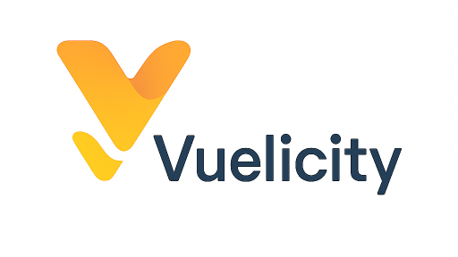

# Vuelicity

<div align="center">
<p></p>
<p>
<a href="https://www.npmjs.com/package/vuelicity"></a>
<a href="https://github.com/DIY-Baazar/vuelicity/blob/main/LICENSE"></a>
</p>
</div>

Vuelicity is a collection of UI components for Vue 3, built with the power and flexibility of Tailwind CSS 4. It's designed to be simple, customizable, and a joy for developers to use.

## Features

- **Vue 3 Ready**: Built from the ground up for Vue 3 and the Composition API.
- **Tailwind CSS 4**: Leverages the latest features of Tailwind CSS for utility-first styling.
- **Customizable**: Components are designed to be easily themed and extended.
- **Developer Experience**: Simple and predictable component APIs.
- **Tree-shakable**: Only import the components you need, keeping your bundle size small.

## Documentation

For full documentation and live examples of all components, please visit our documentation website. The documentation source is located in the `/docs` directory of this repository and is built with VitePress.

Visit [https://diy-baazar.github.io/vuelicity](https://diy-baazar.github.io/vuelicity) for the latest documentation.

## Installation

Install Vuelicity and its peer dependencies using your favorite package manager:

```bash
# Using npm
npm install vuelicity vue tailwindcss

# Using yarn
yarn add vuelicity vue tailwindcss
```

### Setup

1. **Tailwind CSS**: Ensure you have Tailwind CSS configured in your project. If not, you can follow their official guide.

2. **Vuelicity Content**: Add the path to Vuelicity's components to your `tailwind.config.js` file. This allows Tailwind to scan the component files for classes and include them in your final CSS build.

    ```js
    // tailwind.config.js
    export default {
      content: [
        './index.html',
        './src/**/*.{vue,js,ts,jsx,tsx}',
        './node_modules/vuelicity/src/**/*.{vue,js,ts,jsx,tsx}' // Add this line
      ],
      theme: {
        extend: {},
      },
      plugins: [],
    }
    ```

## Usage

You can import components individually and use them in your Vue templates.

Here's an example of how to use the `PubButton` component:

```vue
<template>
  <PubButton theme="primary" rounded="md">
    Click me!
  </PubButton>
</template>

<script setup>
// Assuming Vuelicity components are exported from the main package entry
import { PubButton } from 'vuelicity';
</script>
```

## Contributing

We welcome contributions! If you'd like to contribute, please:

1. Fork the repository.
2. Create a new branch for your feature or fix (`git checkout -b feature/your-feature-name`).
3. Make your changes.
4. Commit your changes with a clear commit message (`git commit -m 'feat: Add some feature'`).
5. Push your branch (`git push origin feature/your-feature-name`).
6. Open a new Pull Request.

### Local Development

To run the documentation site locally for development:

1. Clone the repository.
2. Install dependencies: `npm install`
3. Run the development server: `npm run docs:dev`

This will start the VitePress development server where you can see your changes live.

## License

This project is licensed under the MIT License.
